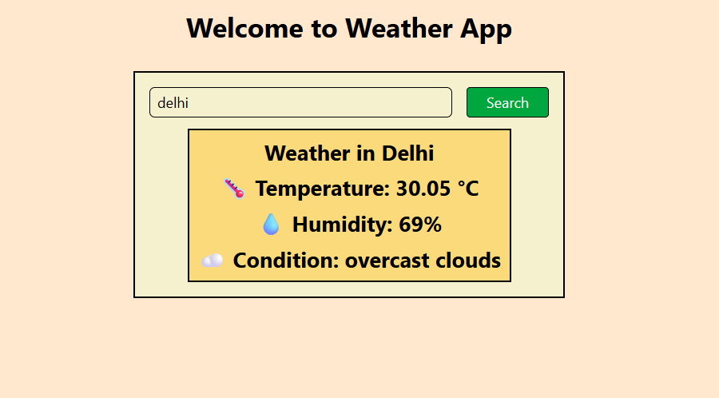

# 🌦️ Weather App

A simple and responsive weather application built with **React + TypeScript + Tailwind CSS**.  
It uses the **OpenWeatherMap API** to fetch real-time weather data.

## 🔗 Live Demo

👉 **[View Live App](https://react-weather-app-fb3c.vercel.app)**

## 🚀 Features

- Search weather by city name
- Displays:
  - 🌡️ Temperature
  - 💧 Humidity
  - ☁️ Weather condition
- Responsive design with Tailwind CSS
- Built with **TypeScript** for better code safety

## 🛠️ Technologies Used

- React
- TypeScript
- Tailwind CSS
- Axios
- OpenWeatherMap API

## ⚙️ Setup Instructions

Clone this repository:

git clone https://github.com/hafeez-07/react-weather-app.git
cd your-repo-name

Install dependencies:

npm install
npm i axios

Create a .env file in the project root and add your API key:

VITE_WEATHER_API_KEY=your_api_key_here
Start the development server:

npm run dev

📸 Screenshot

📌 Note
This project requires an API key from OpenWeatherMap.
You can create a free account and generate your own key.

🤝 Contributing
Pull requests are welcome!

📝 License
This project is open-source and available under the MIT License.
